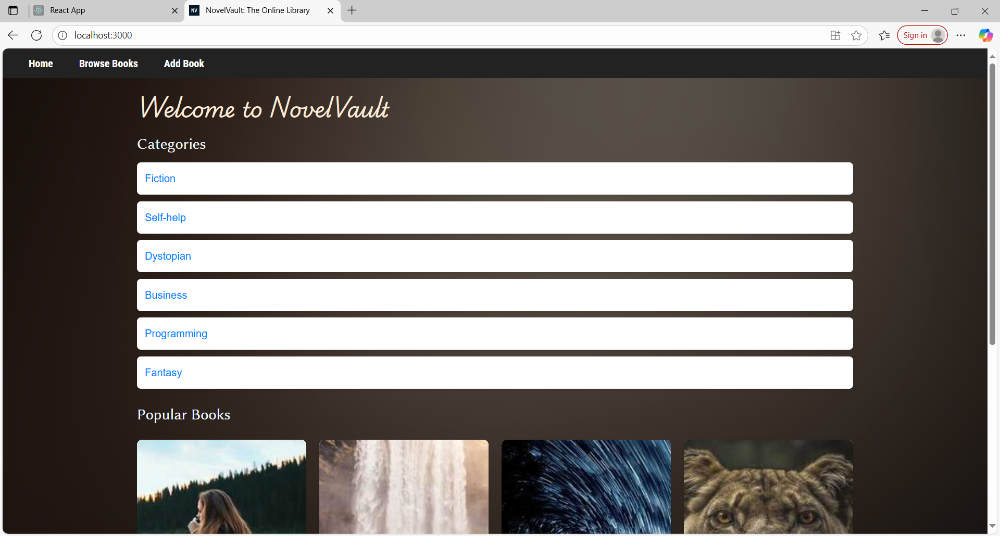
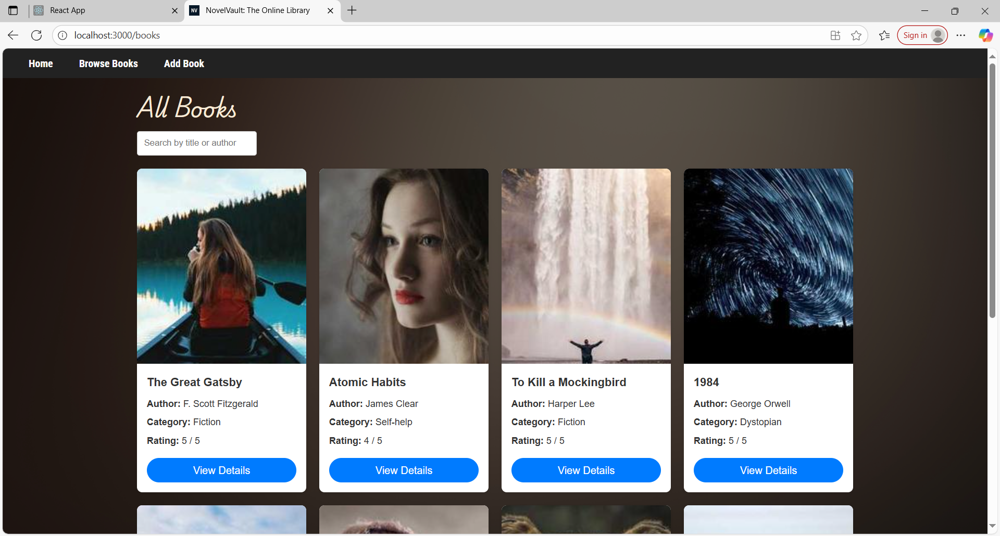
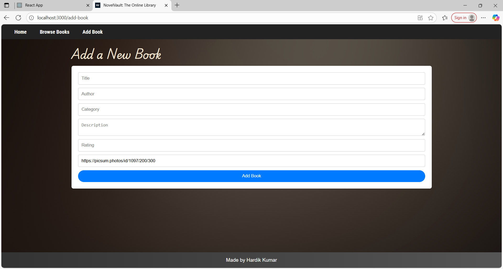

# NovelVault: The Online Library

A React-based online library application where users can browse books, view details, and add new books with cover images.  
Built with **Create React App**, **React Router**, and **Redux Toolkit**.


## 🚀 Features
- **Home Page** with book categories and featured books
- **Browse Page** to view all books in a grid layout
- **Book Details Page** showing description, author, category, and rating
- **Add Book Page** with validation and random cover image generation

## 📸 Screenshots

### Home Page




### Add Book Page



## Tech Stack
- **React** (Create React App)
- **Redux Toolkit** for state management
- **React Router DOM** for navigation
- **CSS Flexbox/Grid** for layout
- **Picsum Photos API** for placeholder book covers


## ⚙️ Installation & Setup
```bash
# Clone the repo
git clone https://github.com/yourusername/nv-library.git

# Move into project folder
cd nv-library

# Install dependencies
npm install

# Start development server
npm start
```
App will run on **http://localhost:3000/**

---

## Adding a New Book
- Go to **Add Book** page
- Fill in Title, Author, Category, Description, Rating
- An image cover is pre-filled (can be replaced)
- Click **Add Book** — it will appear instantly in the Browse page

---

## Data Persistence & Versioning
Books are stored in `localStorage` with a version key.  
When dummy data changes, updating the version in `store/index.js` automatically refreshes stored books.

---

## Customization
- **Change App Title:** Edit `<title>` in `public/index.html`
- **Change Favicon:** Replace `public/favicon.png`
- **Change Dummy Data:** Edit `src/data/dummyBooks.js`

---

[Repository Link](https://github.com/hardikjha/online-library)
